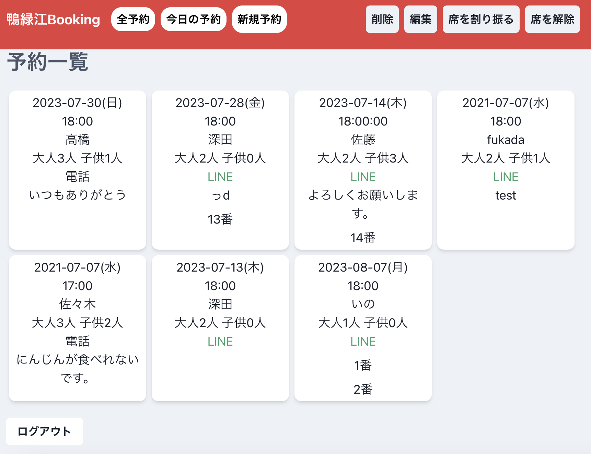

# ポートフォリオは従業員が使う予約管理アプリです

[焼肉鴨緑江 予約管理アプリ](https://booking.yunonn.net)

# サービスコンセプト
簡単操作でいつでもどこでも従業員が予約の管理をできます。

# 背景
父が経営する個人型飲食店の50代と30代の従業員と自分が予約のダブルブッキングと記載ミスをしてしまう課題を解決するために開発しました。来店された際、スムーズに席まで案内することで顧客満足度アップを図ります。このアプリでは入力を最初の一度と編集する際だけにし、それ以外はボタンで操作できるようにすることでミスと手間を減らします。

# 使用技術
|カテゴリー|技術名|
|---|---|
|フロントエンド|React, ChakraUI|
|バックエンド|Rails|
|インフラ|AWS(EC2, RDS, Route53, ACM, ALB, VPC, IAM)|
|データベース|PostgreSQL|
|モニタリング|Sentry, Route 53 Health Check|
|CI/CD|GitHub Actions|
|その他| Git, GitHub, Notion, draw.io, Figma|

# 技術の選定理由

**フロントエンド選定理由**

- **技術候補**: React + ChakraUI、HTML + CSS + JavaScript、RailsのView の中から、**React + ChakraUI**を選択しました。以下、採用理由を詳しく説明いたします。
1. **効率性と速度**: ReactはVirtual DOMを採用しており、変更が必要な部分だけを効率的に更新できる点で、通常のJavaScriptやRailsのViewよりも優れています。この特性により、ページ全体の再レンダリングを削減し、高速なレスポンスを実現できます。
2. **ユーザー体験の向上**: Reactを利用することでシングルページアプリケーション(SPA)を実現できます。SPAのアーキテクチャはサーバーとの通信を最小限に抑え、ページの遷移なしでコンテンツの更新を行うことができるため、ユーザーにとって快適なブラウジング体験が提供されます。
3. **コンポーネントの再利用性**: Reactはコンポーネントベースのアーキテクチャを採用しているため、一度書いたコンポーネントを他の場面でも再利用しやすく、コードの整理やメンテナンスが容易になります。
4. **開発効率の向上**: ChakraUIは多くのUIコンポーネントを提供しており、これらを活用することで開発速度を大幅に向上させることが可能です。例えば、ChakraUIのToast機能を利用することで、手間なく動的なメッセージ表示を実装することができます。

**バックエンド選定理由**

- **技術候補**: Rails と Express.js の中から、**Rails**を選択しました。以下、採用理由を詳しく説明いたします。
1. **開発速度の迅速性**: Railsは"Convention over Configuration"を採用しており、設定よりも慣習を重視します。これにより、冗長な設定やブートストラッピングを極力避け、迅速に開発を進めることができます。一方、Expressは設定が豊富で柔軟性が高いが、初期セットアップに時間がかかることが多いです。
2. **エコシステムの豊富さ**: Railsのエコシステムは非常に成熟しており、多くのジェムやツールが提供されています。これにより、機能の追加や拡張が容易です。対照的に、ExpressはNPMを通じて多くのパッケージにアクセスできますが、それらを組み合わせて望む機能を実現することが必要です。
3. **セキュリティの強化**: Railsは多くのセキュリティリスク（SQLインジェクション、クロスサイトスクリプティングなど）に対してデフォルトで保護機能を提供しています。Expressでもセキュリティを強化するためのミドルウェアは存在しますが、これを自ら選択して実装する必要があります。
4. **開発コミュニティの活発さ**: Railsは長い歴史を持つフレームワークで、活発なコミュニティと豊富なドキュメントがあります。これにより、問題のトラブルシューティングや新しい機能の学習が容易です。Expressも活発なコミュニティを持っていますが、Railsほどの歴史やドキュメントの充実度はありません。

**インフラ選定理由**

- **技術候補**: AWS、Render、Herokuの中から**AWS**を採用しました。以下、各技術の特性を基にした採用理由を詳しく説明いたします。
1. **拡張性**: AWSはEC2, S3, RDSなどの豊富なサービス群を提供しており、これらの組み合わせにより、独自性の高い、複雑なアーキテクチャも構築が可能です。RenderやHerokuはPaaSとして優れていますが、特定の要件や大規模なシステムに対して、AWSのようなIaaSが提供する柔軟性とカスタマイズ性が求められることが多く、その点でAWSを選択しました。
2. **セキュリティ**: AWSはVPC, IAM, セキュリティグループなどの強固なセキュリティ関連サービスを提供しており、さらに多くのセキュリティ標準認証も取得しています。このプロジェクトにおいても、セキュリティグループを利用し、EC2からのみRails APIにアクセスできるような構成を実現しました。このようなセキュリティ対策を容易に実装できるのもAWSを選択する大きな理由の一つとなります。

**JWT認証採用理由**

トークンの扱いにさえ気をつければサーバーへの負担が少ないので採用しました。以下メリットとデメリットです。

**メリット:**

1. **ステートレス性**: JWTは自己完結型であり、トークン自体に認証情報がエンコードされているため、サーバー側でセッション情報を保持する必要がありません。これにより、ステートレスなAPIを実現しやすくなります。
2. **自己完結型**: JWTはユーザー情報、発行日、有効期限などの情報を内包しているため、それだけで認証や情報の交換が可能です。
3. **パフォーマンス**: セッションベースの認証と比較して、サーバーのリソースを消費することなく、リクエストごとの認証を行うことができます。

**デメリット:**

1. **トークンの無効化がしづらい**: JWTのステートレスな性質上、一度発行されたトークンの無効化は難しくなります。例えば、ログアウトやセキュリティ上の理由で特定のトークンを無効にしたい場合、サーバー側でトークンのブラックリストを持つなどの追加の手段が必要となります。
2. **トークンを悪用される可能性がある**: JWTの保護や秘密鍵の管理は慎重に行う必要があります。トークンが漏洩すると、そのトークンが有効期限内であれば悪意のある者に利用される危険があります。
3. **有効期限の管理**: トークンの有効期限を適切に設定することが必要です。短すぎるとユーザビリティが損なわれ、長すぎるとセキュリティリスクが高まります。

アプリイメージ

システム構成図(インフラ)

ワイヤーフレーム図

# その他のポートフォリオ
[unityroom](https://unityroom.com/users/7qaijm2pyt3r0zkfvod5)
Unityで作ったゲームです。

[鴨緑江タブレット注文システム](https://oreder-ouryokukou.web.app/login/)
ReactとFirebaseで作成しています。

### 座席番号1でログイン

- Email: 1@gmail.com

- pass: yakiniku1

### マスターアカウントでログイン(注文を受信できます。)

- Email: master@gmail.com

- pass: yakiniku100

[鴨緑江ホームページ](https://ouryokukou.com/)
WordPressで作成しています。

# オリジナルプロダクトのドキュメント
お時間のある方はご覧ください。

[week5-6 テーマ決め](https://www.notion.so/week5-6-d079c54c99e948c689bb75e4997c84d0?pvs=4)

[week7-8 要件定義](https://www.notion.so/week7-8-c341dbe260aa42c7bec8a2323f211a09?pvs=4)

[week9-10 設計1](https://www.notion.so/week9-10-1-bd73292925a84578ad2e36ecf1bb1d58?pvs=4)

[week10-11 設計2](https://www.notion.so/week11-12-2-4bdaeca48988446fbab91ec8ea74b5e4?pvs=4)

[仕様とテスト](https://utopian-earth-71a.notion.site/6944b5220d5640c79facf15bd0ee0039?pvs=4)

[デプロイ手順書](https://www.notion.so/25a68208638c4e13995963a7b7eae31d?pvs=4)
